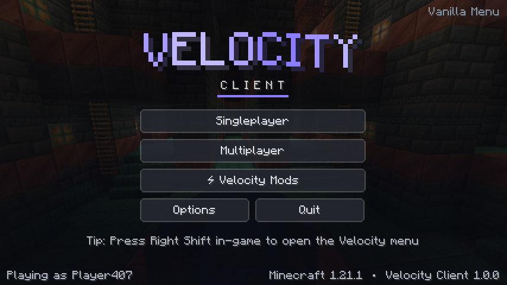
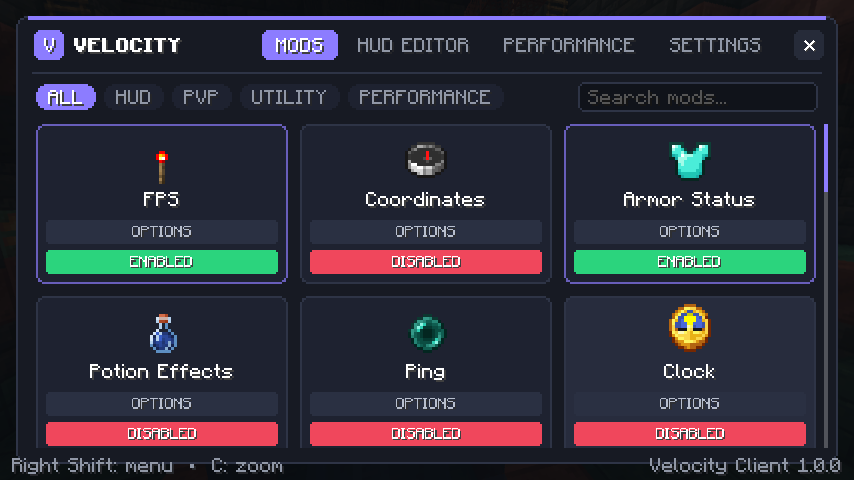
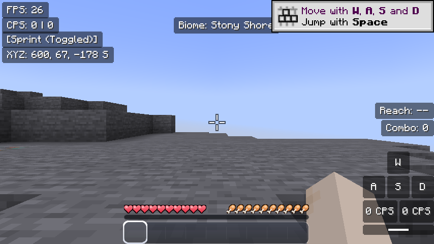
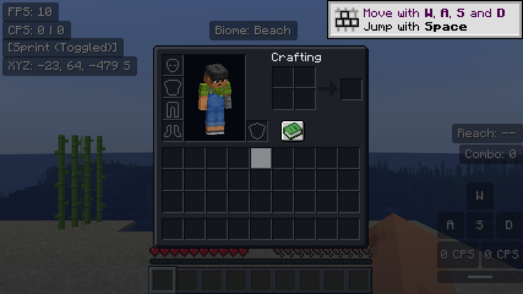
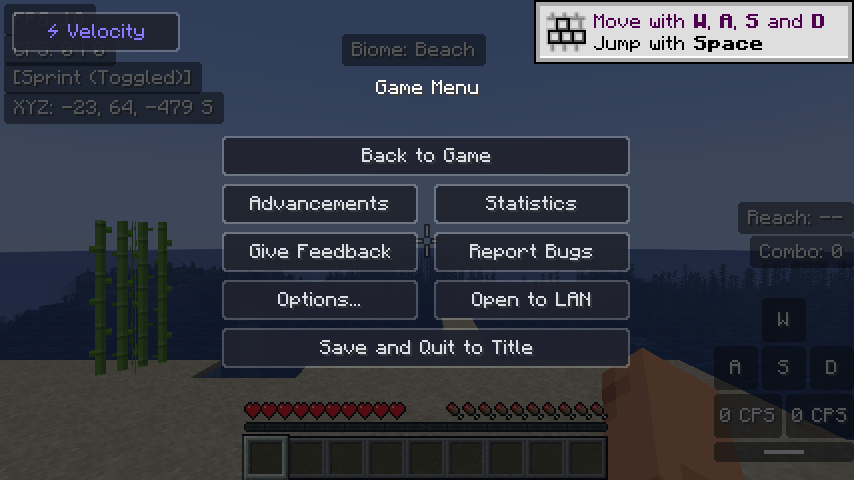
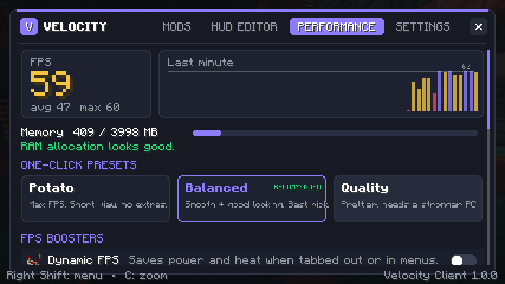

# ⚡ Velocity Client

A fast, clean and fun Minecraft Java client for **1.21.1**, built on Fabric.
It has a Feather-style mod menu, a drag-and-drop HUD editor, PvP mods and FPS boosters tuned for low-end PCs.
It works with normal Fabric mods: drop them in the mods folder.

| Main menu | Mods |
| --- | --- |
|  |  |
| **In game** | **Dark inventory** |
|  |  |
| **Themed pause menu** | **Performance** |
|  |  |

*These are real screenshots from the automated CI test, which launches the game on every push.*

## Install (Windows, one click)

1. Install the official **Minecraft Launcher** and open it once.
2. Download **Velocity-Client** from the latest
   [Release](https://github.com/ananttomar232-tech/VelocityClient/releases) or from the
   [Actions build](https://github.com/ananttomar232-tech/VelocityClient/actions) artifact, then unzip it.
3. Double-click **`Install-Velocity.bat`**.
4. Open the Minecraft Launcher, pick **Velocity Client** next to Play, then press **Play**.

The installer:

- installs Fabric Loader for 1.21.1
- downloads Fabric API and lightweight FPS mods from Modrinth: **Sodium**, **Lithium**, **FerriteCore**,
  **ImmediatelyFast**, **EntityCulling**, **ModernFix**, **Krypton**, **Noisium** and **BadOptimizations**, plus **Mod Menu**
- asks whether you want **Iris shaders** with the very light **MakeUp Ultra Fast** pack (off by default, because
  shaders cost a lot of FPS on integrated graphics)
- asks whether you want **Fresh Animations** (smooth mob animations, with EMF + ETF), and switches it on for you
- asks whether you want light **animation mods**: Not Enough Animations, Eating Animation, Smooth Swapping,
  Wavey Capes, Animatica and Falling Leaves (with Cloth Config)
- asks whether you want lightweight **resource packs**: **Icons**, **Animated Items** and **xali's Enchanted Books**,
  and switches them on

Everything it installs is client-side only, so it works on any server.
- creates a separate game folder `%APPDATA%\.velocity`, so your normal Minecraft is not touched
- adds a launcher profile with a 4 GB heap and low-pause G1 garbage collection, tuned for 16 GB RAM

Running it again updates everything.

## Controls

| Key | What it does |
| --- | --- |
| **Right Shift** | Open the Velocity menu |
| **C** (hold) | Zoom. Scroll while zooming to zoom further |
| **Left Alt** (hold) | Freelook - look around your character |
| Sprint key (tap) | Toggle Sprint on/off |
| *unbound* | HUD Editor (set it in Controls) |

You can change any of these in **Options → Controls → Key Binds → Velocity Client**.

## What's inside

**Menu**: a grid of mod cards with **ENABLED / DISABLED** buttons and **OPTIONS** for each mod.
It also has category filters (HUD / PvP / Utility / Performance) and search: start typing on the Mods page.
Seven accent colours, smooth animations and a custom main menu.

**Whole-game theme**: every vanilla button and slider gets the Velocity style with hover animations.
Menus get dark backgrounds, and inventories, chests, furnaces and the advancements window are recoloured dark.
In-game screens fade in. You can switch each part off in **Settings → Interface Theme**.

**Built-in resource packs**, drawn for Velocity and switched on by default (toggle in **Settings** or Options → Resource Packs):
- **Velocity Icons**: smooth HD (4× resolution) hearts (every type: poison, wither, absorption, frozen, hardcore), hunger, armor,
  air bubbles, a see-through rounded hotbar, a gradient XP bar and a clean crosshair.
- **Velocity Clear Glass**: glass and all 16 stained glass colours without the streaks.

**Transparency** (**Settings → Transparency**) has sliders for menus and buttons, inventory windows,
HUD backgrounds, the hotbar (items stay solid) and the chat background.

**HUD Editor**: drag elements anywhere. They snap to the screen centre, the edges and each other.
Scroll over an element to resize it, or right-click it for its options.
Every HUD mod has Scale, Background and Text Color (White / Accent / Chroma rainbow) settings.

| HUD | PvP | Utility | Performance |
| --- | --- | --- | --- |
| FPS | Keystrokes (with CPS) | Zoom | Dynamic FPS |
| Coordinates | CPS | Freelook | No Menu Blur |
| Armor Status | Toggle Sprint | Fullbright | Memory |
| Potion Effects | Custom Crosshair | No Pumpkin Blur | One-click presets |
| Ping, Clock, Direction, Speed | Reach Display | | Live FPS graph |
| Server IP, Biome, Day Counter | Combo Counter, No Hurt Cam, Low Fire | | |

## Getting the most FPS (i3 10th gen + Intel UHD + 16 GB)

Velocity applies the **Balanced** preset on first launch. Open **Right Shift → PERFORMANCE** to switch:

- **Potato**: maximum FPS (render distance 6, minimal particles, no clouds).
- **Balanced**: recommended (render distance 8, fast graphics, no clouds or shadows).
- **Quality**: prettier, for when you are plugged in and standing still.

Other things that help a lot on a Dell laptop with integrated graphics:

1. **Use Sodium.** The installer adds it. It is the single biggest FPS boost, often 2–3× on Intel graphics.
2. **Plug in the charger** and set Windows power mode to **Best performance**.
3. In Windows **Settings → Display → Graphics**, add `javaw.exe` and set it to **High performance**.
4. Keep **Dynamic FPS** on. It drops to 10 FPS when you tab out, so your laptop stays cool and does not
   throttle when you come back.
5. Don't use shaders on integrated graphics.

## Adding your own mods

Put any **Fabric 1.21.1** mod `.jar` into `%APPDATA%\.velocity\mods`
(or **Right Shift → SETTINGS → Open Mods Folder**). Velocity runs alongside them.

## Building from source

Needs JDK 21.

```bash
./gradlew build          # jar in build/libs/
./gradlew runClient      # start a dev instance (Windows: run-dev.bat)
```

Every push is built by GitHub Actions. Push a tag like `v1.0.0` to publish a Release with the jar and installer.

## Project layout

```
src/main/java/com/velocity/client/
  VelocityClient.java        entrypoint, keybinds, events
  VelocityConfig.java        JSON config (config/velocity-client.json)
  module/                    Module, settings, ModuleManager
  module/hud/                HUD element base classes
  module/impl/               all mods (FPS, Keystrokes, Zoom, ...)
  gui/                       menu, HUD editor, main menu
  mixin/                     zoom FOV, click counter, dynamic FPS, fullbright, main menu
  util/                      drawing helpers, presets, FPS tracker
installer/                   Windows one-click installer
```

## License

MIT
